<div align="center">



<br>

[](mailto:kaneka4850@gmail.com)
[](https://www.linkedin.com/in/cleberaugustobioinfo)
[](https://github.com/Kaneka4850)
[](https://discord.com/users/443894774156623884)

</div>

---

## `$ cat sobre.json`  <sub>自己紹介 · jikoshōkai</sub>

```json
{
  "nome": "Cleber Augusto",
  "cargo": "Bioinformata Clínico | Analista de Variantes Genéticas",
  "foco": [
    "Análise de variantes somáticas, germinativas e estruturais",
    "Classificação ACMG (germinativas) e VICC (somáticas)",
    "Desenvolvimento de pipelines NGS em Python, Bash e Snakemake",
    "Engenharia de dados genômicos com integração de IA"
  ],
  "formacao": [
    "Pós-graduação em Bioinformática Aplicada à Genômica Médica, Einstein (2026)",
    "Bacharelado em Biomedicina, UNIP (2025)"
  ],
  "fun_fact": "アニメ (anime) e energético em quantidade questionável"
}
```

---

## `$ ls stack/`  <sub>技術 · gijutsu</sub>

```bash
linguagens/    Python  Bash  SQL  Snakemake
bioinfo/       GATK  BWA  VEP  Samtools  Bedtools  IGV
formatos/      FASTQ  BAM  VCF
bases/         gnomAD  1000 Genomes
infra/         Linux (Ubuntu/Debian)  Docker  AWS  Git
```

---

## `$ cat experience.log`  <sub>経歴 · keireki</sub>

| Período | Cargo | Empresa | O que eu fiz |
|---|---|---|---|
| Mar 2026 - atual | Desenvolvedor Principal | **Tiro Legal** | Pipeline de extração de dados estruturados com Python, Pydantic e Gemini 2.5 Flash. Mais de 2.000 imagens clínicas processadas. |
| Fev 2025 - Mar 2026 | Assistente de Dados | **G16 Premium** | Automação de rotinas em Python e construção de dashboards. Redução de 15% no tempo operacional. |
| Fev 2024 - Dez 2024 | Estagiário em Análises Clínicas | Laboratório de Ensino | Mais de 500 amostras processadas em Bioquímica, Hematologia e Microbiologia. |

---

## `$ cat formacao.txt`  <sub>学歴 · gakureki</sub>

```text
Pós-graduação Lato Sensu
Bioinformática Aplicada à Genômica Médica: Análise de Variantes Somáticas e Germinativas
Hospital Israelita Albert Einstein  |  conclusão: fev 2026

Bacharelado em Biomedicina
Universidade Paulista (UNIP)  |  conclusão: jan 2025
Foco: Genética, Citogenética e Análises Clínicas
```

---

## `$ ls projetos/`  <sub>プロジェクト · purojekuto</sub>

### Analisador de Documentos Clínicos

Pipeline de extração de dados estruturados a partir de cerca de 2.000 imagens de avaliações psicológicas. Usa a API do Google Gemini para leitura, Pydantic para validar o esquema de saída e Docker para reprodutibilidade.

`Python` `Pydantic` `Gemini API` `Docker`

[Ver repositório](https://github.com/Kaneka4850/Analisador-de-documentos)

---

## `$ ls certificacoes/`  <sub>資格 · shikaku</sub>

```bash
AWS_Cloud_Practitioner.cert
USP_Curso_Verao_Bioinformatica.cert
BP_Variantes_Cardio_Onco.cert
GOV_Analise_Dados_R.cert
Trissomia_Livre_Citogenetica.cert
```

---

## `$ git log --stat`  <sub>活動 · katsudō</sub>

<div align="center">

<a href="https://github.com/Kaneka4850">
  
</a>

</div>

---

<div align="center">

```text
# 継続は力なり
# keizoku wa chikara nari  (persistência é poder)

cleber@kaneka4850:~$ exit
logout
Connection to kaneka4850 closed.
```

</div>
